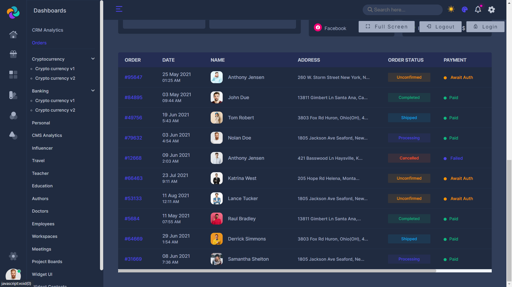
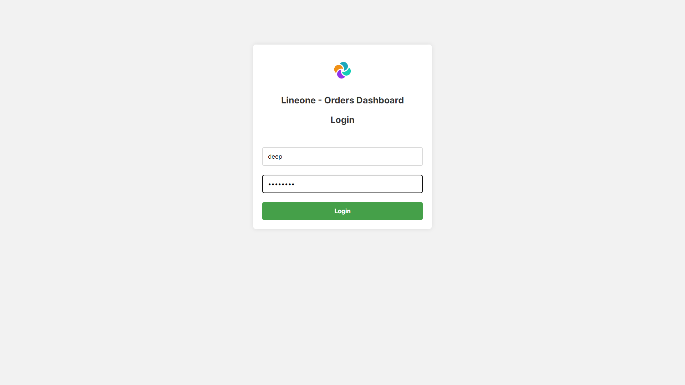
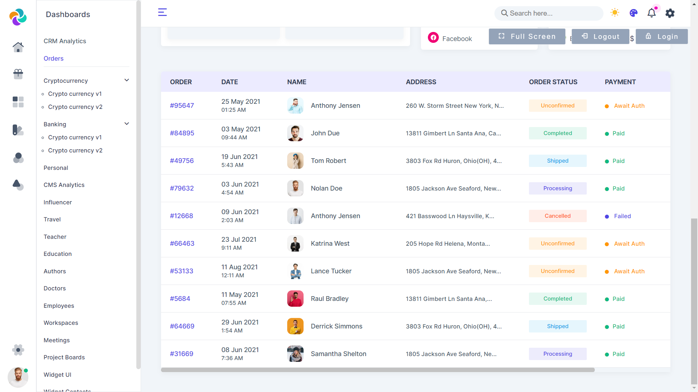

# CSS3 Admin Dashboard

Most Supirior admin panel using CSS3 and Jquery on Github.

[Live Demo](https://deepk2891.github.io/Admin-panel-1-CSS3/)

## Note

To get started, clone or download the project
Then Open index.html.

### Dashboard

### Dark mode

### Login

### Use profile

### Settings sidebar

### User Table

### ⚙ VS Code Extensions I Use:

-   🔗 [Prettier - Code formatter](https://marketplace.visualstudio.com/items?itemName=esbenp.prettier-vscode)
-   🔗 [Material Icon Theme](https://marketplace.visualstudio.com/items?itemName=PKief.material-icon-theme)
-   🔗 [Live Server](https://marketplace.visualstudio.com/items?itemName=ritwickdey.LiveServer)
-   🔗 [Auto Rename Tag](https://marketplace.visualstudio.com/items?itemName=formulahendry.auto-rename-tag)
-   🔗 [IntelliCode](https://marketplace.visualstudio.com/items?itemName=VisualStudioExptTeam.vscodeintellicode)
-   🔗 [HTML CSS Support](https://marketplace.visualstudio.com/items?itemName=ecmel.vscode-html-css)
-   🔗 [IntelliSense for CSS class names in HTML](https://marketplace.visualstudio.com/items?itemName=kang-sw.html-css-class-completion-everywhere)
-   🔗 [HTML to CSS autocompletion](https://marketplace.visualstudio.com/items?itemName=solnurkarim.html-to-css-autocompletion)
